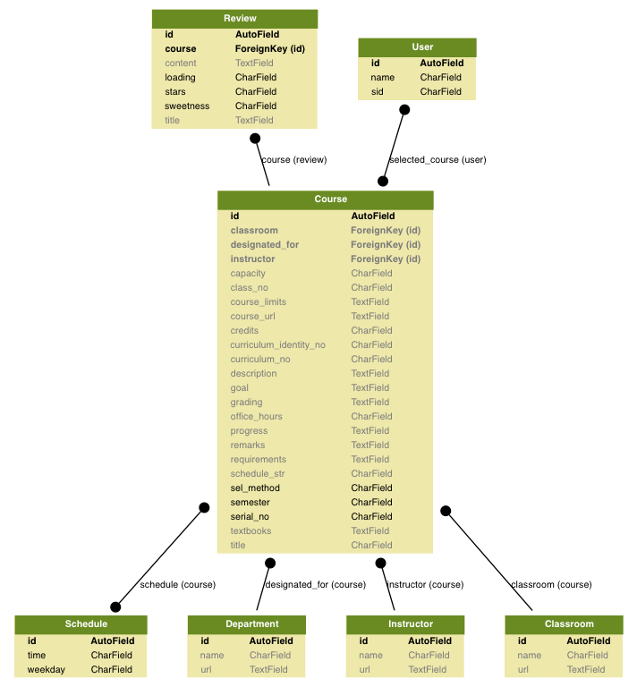

# NTUCB

## Installation
Run ``sh install.sh`` and you may access django admin by [http://localhost:8000/admin](http://localhost:8000/admin) or make queries using ``python3 manage.py shell``

## Template generation
``python3 generate_template.py``
Generated files will be put in ``request_template`` folder.

~1M sentences for each goal.

## Current DB schema:

