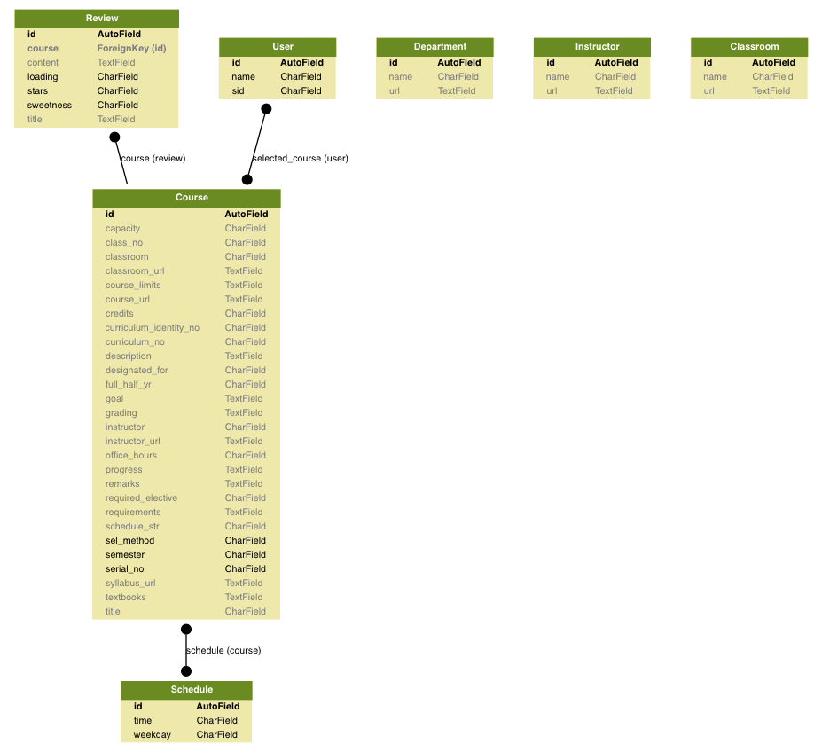

# [NTUCB](https://yvchen.github.io/CourseBot2/)

## Website
[https://ntu-course-chatbot.ml/](http://ntu-course-chatbot.ml/)

## Installation

Create a Python3 ``virtualenv`` and run ``sh install.sh``.

We used ``theano`` backend, which can be set in ``~/.keras/keras.json``.

## Functionalities

After install, you may access

- ``python3 manage.py runserver``
    - Interactive demo site
    	- Rule-based: [http://localhost:8000](http://localhost:8000)
    	- RL: [http://localhost:8000/rl](http://localhost:8000/rl)
	-  Django admin [http://localhost:8000/admin](http://localhost:8000/admin)
- ``python3 manage.py shell``
	-  Making queries in Django interactive shell

## Template generation
``python3 generate_template.py``
Generated files will be put in ``request_template`` folder.

```text
request_template
├── [   90775360]  classroom.txt
├── [   65659689]  instructor.txt
├── [   87333770]  schedule.txt
└── [   79905920]  title.txt
```

~1M sentences for each goal.

## Current DB schema:



* **Course** (raw_type: [html-format](crawler/md-based_course-table_example.html))


    |  Semester  |  Serial_no  |  Designated_for  |  Curriculum_no  |  Class_no  |  Title   |  Credits  |  Curriculum_identity_no  |  Full_half_yr  |  Required_elective  |  Instructor  |                             Instructor_url                              |  Sel_method  |  Schedule_str  |  Classroom  |                  Classroom_url                   |  Capacity  |               Course_limits                |                     Remarks                      |                                                               Syllabus_url                                                               |  Description  |  Goal  |  Requirements  |  Office_hours  |  Textbooks  |  Grading  |  Progress  |  Course_url  |
    |:----------:|:-----------:|:----------------:|:---------------:|:----------:|:--------:|:---------:|:------------------------:|:--------------:|:-------------------:|:------------:|:-----------------------------------------------------------------------:|:------------:|:--------------:|:-----------:|:------------------------------------------------:|:----------:|:------------------------------------------:|:------------------------------------------------:|:----------------------------------------------------------------------------------------------------------------------------------------:|:-------------:|:------:|:--------------:|:--------------:|:-----------:|:---------:|:----------:|:------------:|
    |   104-1    |    73565    |      網媒所      |    CSIE5430     |            | 機器學習 |     4     |        922 U4240         |      半年      |        選修         |    林軒田    | http://nol2.aca.ntu.edu.tw/nol/coursesearch/teacher.php?op=s2&td=902083 |      2       |   一3,4三3,4   |    資103    | http://map.ntu.edu.tw/ntu.html?layer=&uid=AT3001 |    176     | 限學士班三年級以上,本校修課人數上限：176人 | 初選不開放。本課程將配合開設大型線上開放式課程。 | http://nol2.aca.ntu.edu.tw/nol/coursesearch/print_table.php?course_id=922 U4240&class=&dpt_code=9440&ser_no=73565&semester=104-1&lang=CH |               |        |                |                |             |           |            |              |


* **Review** (raw_type: [html-format](crawler/md-based_review-table_example.html))

    |            Title             |  Loading  |  Sweetness  |  Stars  |                                                                                                                                                                                                                                                                                                                                                                                                                                                                                                                   Content                                                                                                                                                                                                                                                                                                                                                                                                                                                                                                                    |  Sentiment  |  Probability  |
    |:----------------------------:|:---------:|:-----------:|:-------:|:--------------------------------------------------------------------------------------------------------------------------------------------------------------------------------------------------------------------------------------------------------------------------------------------------------------------------------------------------------------------------------------------------------------------------------------------------------------------------------------------------------------------------------------------------------------------------------------------------------------------------------------------------------------------------------------------------------------------------------------------------------------------------------------------------------------------------------------------------------------------------------------------------------------------------------------------------------------------------------------------------------------------------------------------:|:-----------:|:-------------:|
    | [評價] 105-1 臺灣史一 李文良 |     0     |      0      |    0    | （是／否／其他條件）：是 哪一學年度修課： 105-1 ψ 授課教師 (若為多人合授請寫開課教師，以方便收錄) 李文良 λ 開課系所與授課對象 (是否為必修或通識課 / 內容是否與某些背景相關) 歷史系大一必修 δ 課程大概內容 明末/大航海時代~開港前台灣史 Ω 私心推薦指數(以五分計) ★★★★★ 滿天星 η 上課用書(影印講義或是指定教科書) 自編講義，可於ceiba取得 μ 上課方式(投影片、團體討論、老師教學風格) 口述+一點點版書，不過老師聲音頗輕柔，太累的話就QQ惹 σ 評分方式(給分甜嗎？是紮實分？) 好像頗甜，每個星期都有指定閱讀，紮實與否純看用功程度XD ρ 考題型式、作業方式 三篇讀書心得，期末考申論題+名詞解釋 ω 其它(是否注重出席率？如果為外系選修，需先有什麼基礎較好嗎？老師個性？ 加簽習慣？嚴禁遲到等…) 全簽，助教課要到，正課好像是隨老師心情點名 Ψ 總結 如果每個星期讀書的話其實會覺得正課有點無聊，然後期末考都好簡單這樣XD 不過依照討論課的情況，真的每星期讀的人好像不多 然後討論課刷存在感好像++++++很多分～ 　　　　　　　 讀書心得給分頗甜 我大概16個星期(18扣期中期末)認真讀了13個星期吧(圖書館大好OwO) 最後A+ 有讀書的話期末考唯一的困擾就是手痠 -- |  Positive   |      0.6      |


## References

- Bordes, Antoine, and Jason Weston. "[Learning end-to-end goal-oriented dialog.](https://arxiv.org/pdf/1605.07683.pdf)" Proceedings of The 5th International Conference on Learning Representations. 2017.
(last updated: 2017/4/17)

- Serban, Iulian Vlad, et al. "[Generative Deep Neural Networks for Dialogue: A Short Review.](https://arxiv.org/pdf/1611.06216.pdf)" arXiv preprint arXiv:1611.06216 (2016).
(last updated: 2017/4/17)

- Shah, Pararth, Dilek Hakkani-Tür, and Larry Heck. "[Interactive reinforcement learning for task-oriented dialogue management.](https://static.googleusercontent.com/media/research.google.com/zh-TW//pubs/archive/45734.pdf)" NIPS 2016 Deep Learning for Action and Interaction Workshop. 2016.
(last updated: 2017/4/17)

- Li, Xiujun, et al. "[A User Simulator for Task-Completion Dialogues.](https://arxiv.org/abs/1612.05688)" arXiv preprint arXiv:1612.05688 (2016).  
(github-repo [here](https://github.com/MiuLab/TC-Bot))
(last updated: 2017/4/23)

- Li, Xuijun, et al. "[End-to-end task-completion neural dialogue systems.](https://arxiv.org/abs/1703.01008)" arXiv preprint arXiv:1703.01008 (2017).  
(github-repo [here](https://github.com/MiuLab/KB-InfoBot))
(last updated: 2017/4/23)

- Yun-Nung Chen, et al. "[End-to-End Memory Networks with Knowledge Carryover for Multi-Turn Spoken Language Understanding](https://www.microsoft.com/en-us/research/wp-content/uploads/2016/06/IS16_ContextualSLU.pdf)
(last updated: 2017/5/6)


